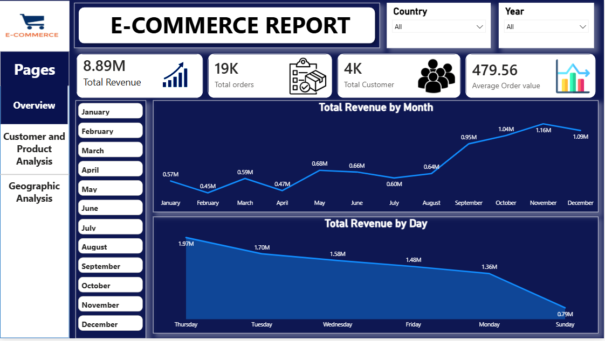
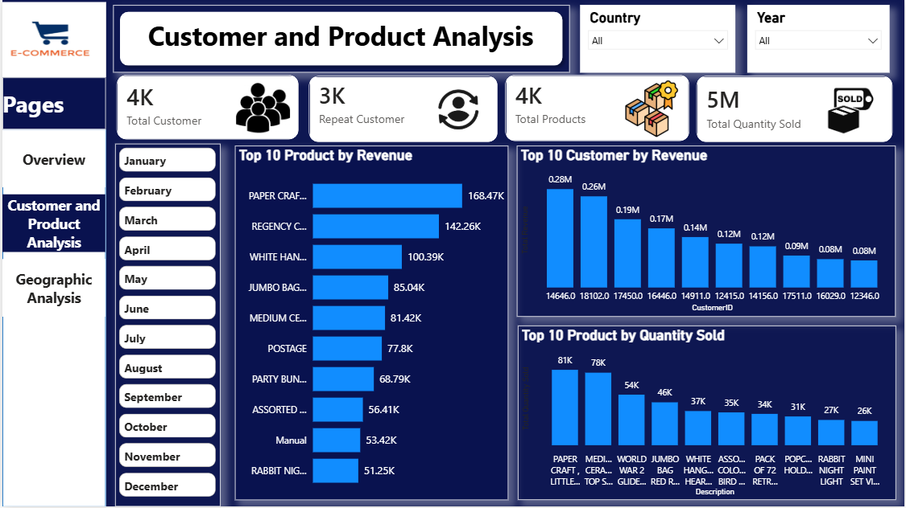
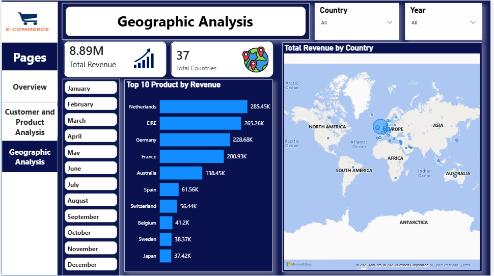

# E-Commerce Sales Analysis | Python & Power BI

## Project Overview

This project focuses on analyzing e-commerce transaction data to identify sales trends, customer behavior, product performance, and geographic revenue insights.

The project follows an end-to-end data analytics workflow:

Raw Data → Data Cleaning → Exploratory Data Analysis → Power BI Dashboard → Business Insights

## Tools & Technologies Used

- Python
- Pandas
- Matplotlib
- Jupyter Notebook
- Power BI
- DAX

# Project Workflow

## 1. Data Cleaning & Preparation (Python)

Performed data cleaning and preprocessing using Python.

Steps performed:

- Loaded and explored raw transaction data
- Checked dataset structure and data types
- Handled missing values
- Removed duplicate records
- Converted columns into appropriate data types
- Created new features:
  - Total Sales
  - Month
  - Year

## Dataset Information

- Original Records: 541,909
- Duplicate Records Removed: 5,225
- Cleaned Records Used For Analysis: 401,604

## 2. Exploratory Data Analysis (EDA)

Performed analysis to understand:

- Monthly sales trends
- Country-wise revenue contribution
- Product performance
- Customer purchasing behavior

## 3. Power BI Dashboard

Created an interactive dashboard using Power BI.

Dashboard Pages:

### Executive Summary

Includes:

- Total Revenue
- Total Orders
- Total Customers
- Average Order Value
- Monthly Sales Trend
- Day-wise Sales Analysis 

### Customer Analysis

Includes:

- Customer revenue contribution
- Repeat customer analysis

### Product Analysis

Includes:

- Top products by revenue
- Top products by quantity sold
- Product performance analysis

### Geographic Analysis

Includes:

- Country-wise revenue analysis
- Top performing markets
- Geographic sales distribution

# Key Business Insights

## Sales Performance

- Total Revenue: £8.89M
- Total Orders: 18,532
- Total Customers: 4,338
- Average Order Value: £479.56

## Monthly Sales Trend

- November generated the highest revenue of approximately £1.16M.
- Year-end months showed stronger sales performance.

## Customer Analysis

- Analyzed 4,338 unique customers to understand purchasing behavior.
- Identified repeat customers who placed multiple orders, showing customer loyalty.
- Found top customers based on total spending contribution.

## Geographic Insights

Top revenue-generating countries:

1. United Kingdom - £7.28M
2. Netherlands - £285.45K
3. EIRE - £265.26K
4. Germany - £228.68K

## Product Insights

Top revenue-generating products:

1. PAPER CRAFT, LITTLE BIRDIE - £168.47K
2. REGENCY CAKESTAND 3 TIER - £142.26K
3. WHITE HANGING HEART T-LIGHT HOLDER	- 100.39K

# Dashboard Preview

## Executive Summary Dashboard

## Customer And Product Analysis Dashboard

## Geographic Analysis Dashboard

# Project Outcome

This project helped me improve my skills in:

- Data Cleaning
- Exploratory Data Analysis
- Data Visualization
- Power BI Dashboard Development
- DAX Measures
- Business Intelligence

## Author

Prajakta Kumbhar
